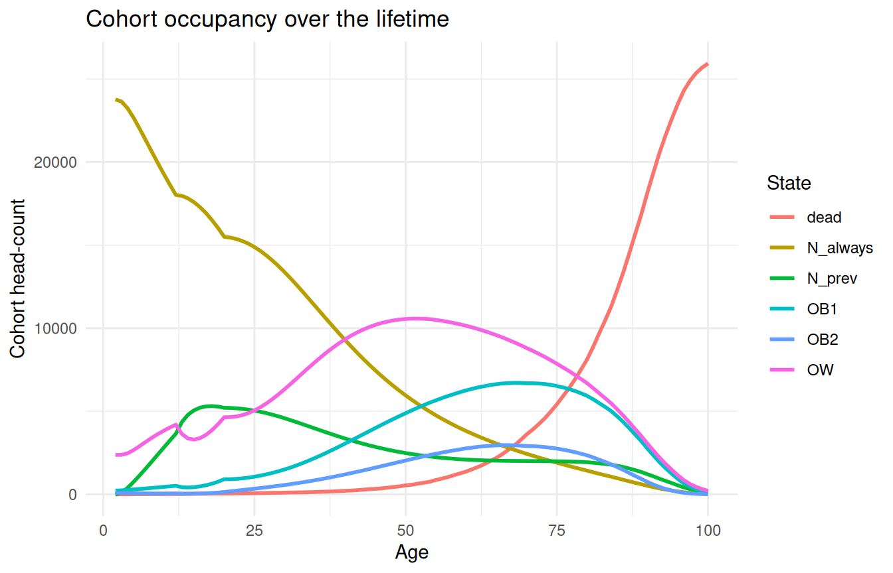
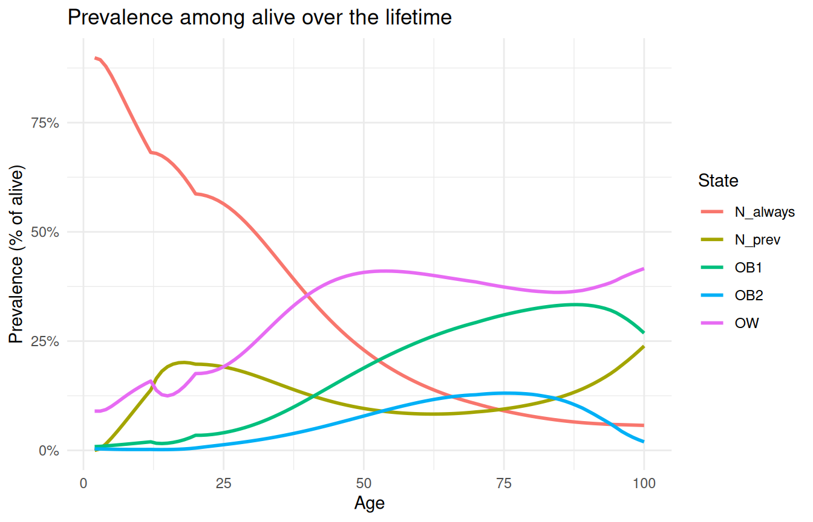
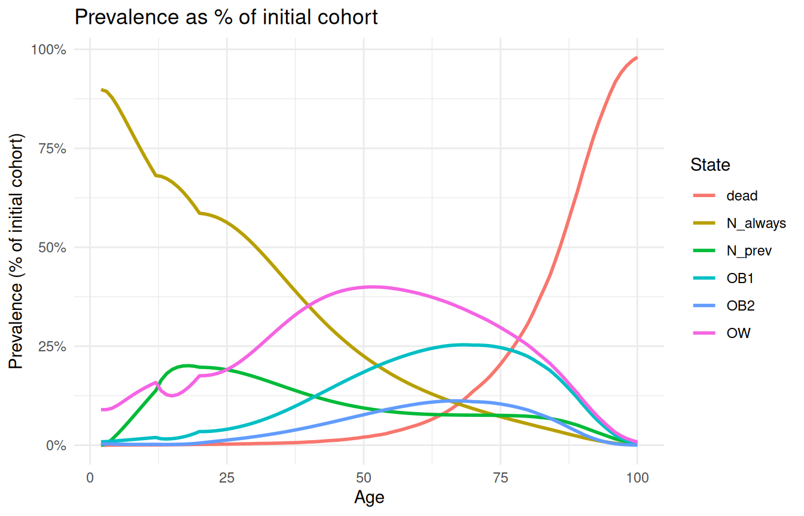
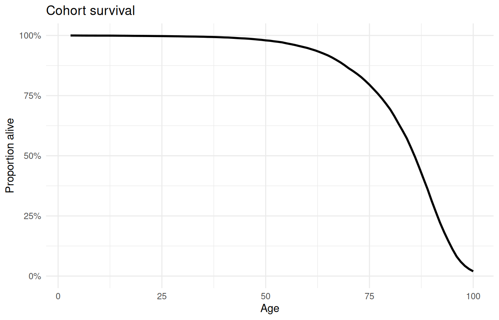
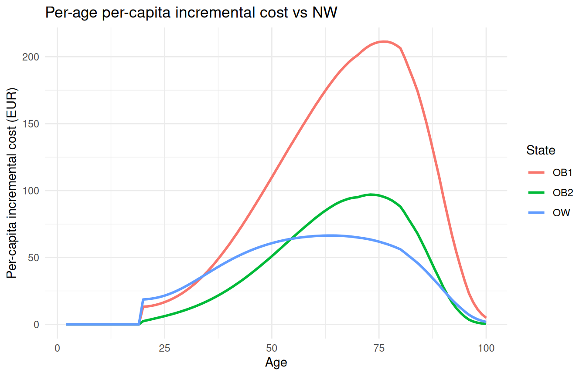
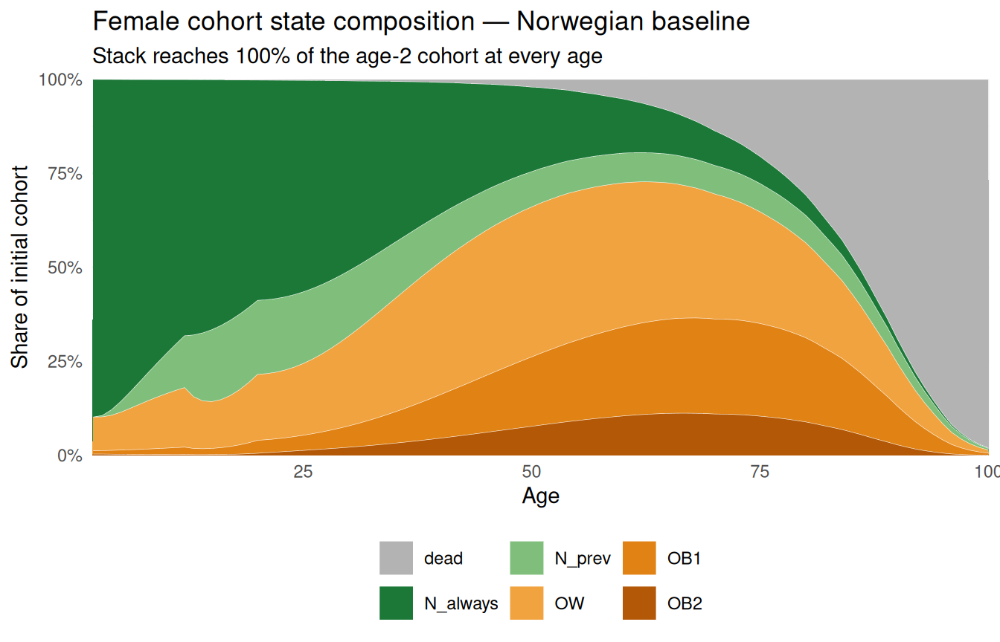
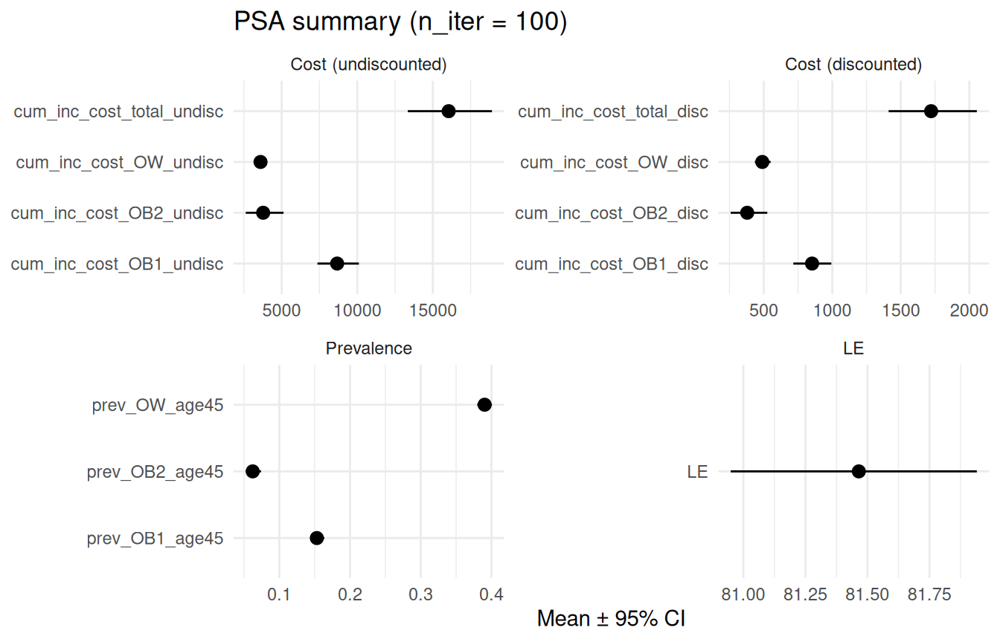
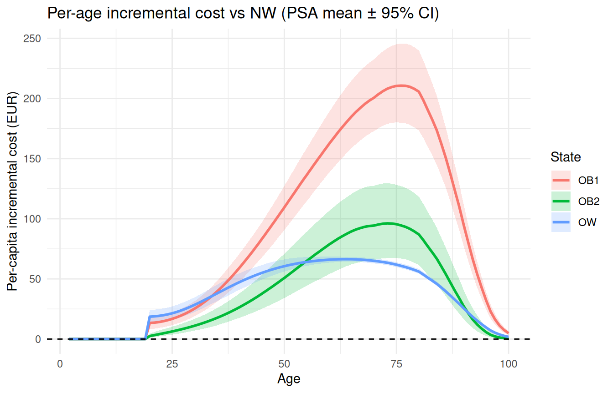

# Getting started with MOON

## What this vignette covers

This is the entry-point tour of the **moon** package: how to run the
published Norwegian model with the bundled inputs and inspect what comes
back. Everything here uses defaults — no parameter editing.

If you want to *modify* the inputs (different costs, tighter mortality
HRs, swap the life table, build your own PSA specs), see the companion
vignette **“Customizing MOON”**.

## 1. The MOON model in one screen

MOON is a **discrete-time Markov cohort model** that simulates a
Norwegian birth cohort from age 2 to ~age 100, in 1-year cycles. The
state space is five live BMI bands plus an absorbing dead state:

- `N_always` — always normal weight (BMI 18.5–25)
- `N_prev` — currently normal weight but previously OW or OB
- `OW` — overweight (BMI 25–30)
- `OB1` — obese grade 1 (BMI 30–35)
- `OB2` — obese grade 2+ (BMI ≥ 35)
- `dead` — absorbing

Transition probabilities come from parametric survival analyses on
Norwegian longitudinal cohorts; mortality is age- and BMI-specific (life
table × hazard ratios from the Global BMI Mortality Collaboration);
costs are per-capita 2009 EUR/year by age and state. The original model
was implemented in Excel — see Bjørnelv et al. 2021, *Medical Decision
Making*,
[doi:10.1177/0272989X20971589](https://doi.org/10.1177/0272989X20971589).
This R port lifts every input into typed objects, adds an S3 layer over
the run output, and exposes a clean PSA path through a parameter-spec
system.

## 2. The public surface

The public API is deliberately compact:

| Function | Purpose |
|----|----|
| `moon_params_norway(sex, uncertainty)` | Build the Norwegian-baseline parameter list (deterministic or PSA-ready). |
| `moon_check_params(params)` | Validate shapes / row sums / value ranges. |
| `moon_deterministic(params, tp_overrides)` | One Markov run; returns a `moon_deterministic`. |
| `moon_psa(spec, n_iter, seed, ...)` | A full PSA; returns a `moon_psa`. |
| [`moon_prevalence()`](https://dache-sdu.github.io/moon/reference/moon_prevalence.md), [`moon_costs()`](https://dache-sdu.github.io/moon/reference/moon_costs.md) | Long-form extractors on a run object. |
| [`print()`](https://rdrr.io/r/base/print.html) / [`summary()`](https://rdrr.io/r/base/summary.html) / [`plot()`](https://rdrr.io/r/graphics/plot.default.html) / [`as.data.frame()`](https://rdrr.io/r/base/as.data.frame.html) | S3 methods on `moon_deterministic` and `moon_psa`. |

The minimum end-to-end example is three lines:

``` r

params <- moon_params_norway("female")
res <- moon_deterministic(params)
summary(res)
```

    <summary.moon_deterministic>
      Sex:         female (cohort N = 26,458)
      Horizon:     ages 2 to 100, discount rate 4%
      LE:          81.49 years
      Total cost:  EUR 3,090,827,645 undisc / EUR 435,536,655 disc
      Prevalence at age 45 (among alive):
        N_always  28.5%
        N_prev  10.9%
        OW     39.1%
        OB1    15.3%
        OB2     6.2%
      Per-capita cumulative incremental cost vs NW (undisc):
        OW   EUR 3,607
        OB1  EUR 8,697
        OB2  EUR 3,800
        All  EUR 16,105

Everything else in this document is layering on top of these calls.

## 3. Loading parameters

[`moon_params_norway()`](https://dache-sdu.github.io/moon/reference/moon_params_norway.md)
builds the engine-shape `params` list for the published Norwegian birth
cohort. Pass one sex per call:

``` r

params_F <- moon_params_norway("female")
str(params_F, max.level = 1)
```

    List of 10
     $ start_age       : int 2
     $ max_age         : int 100
     $ discount_rate   : num 0.04
     $ cost_currency   : chr "EUR"
     $ cohort_n        : Named int 26458
      ..- attr(*, "names")= chr "female"
     $ init_prev       : Named num [1:4] 0.89828 0.08983 0.00861 0.00328
      ..- attr(*, "names")= chr [1:4] "NW" "OW" "OB1" "OB2"
     $ qx              : Named num [1:98] 0.000136 0.000067 0.000132 0.000163 0.000064 0.000031 0.000063 0.000032 0 0.000032 ...
      ..- attr(*, "names")= chr [1:98] "2" "3" "4" "5" ...
     $ mortality_hr    :'data.frame':   3 obs. of  4 variables:
     $ transition_probs:'data.frame':   98 obs. of  7 variables:
     $ cost_df         :'data.frame':   396 obs. of  3 variables:

Slot anatomy:

| Slot | Type | What it carries |
|----|----|----|
| `start_age`, `max_age` | int | model horizon (2 → 100) |
| `discount_rate` | num | 0.04 by default |
| `cost_currency` | chr | “EUR” |
| `cohort_n` | named int | cohort size, key = sex label |
| `init_prev` | named num | NW/OW/OB1/OB2 mass at `start_age` |
| `qx` | named num | NW baseline yearly mortality, ages 2–100 |
| `mortality_hr` | data.frame | HRs vs NW for OW/OB1/OB2 by age band |
| `transition_probs` | data.frame | yearly between-state transitions, ages 2–99 |
| `cost_df` | data.frame | per-capita yearly cost by age × state |

`cohort_n` is a *named* integer (`c(female = 26458L)`) so the sex label
is recoverable from the params alone — useful when you stitch results
from multiple sexes together.

Setting `uncertainty = TRUE` returns the same shape but with the
uncertain slots wrapped as `moon_param_*` spec objects, ready for PSA.
We come back to that in [§11](#psa-on-the-norwegian-baseline).

## 4. Validating with `moon_check_params()`

``` r

moon_check_params(params_F)
```

[`moon_check_params()`](https://dache-sdu.github.io/moon/reference/moon_check_params.md)
is silent on success and errors loudly on problems: shape mismatches,
off-simplex `init_prev`, transition probabilities outside \[0, 1\], age
misalignment between `transition_probs` and `start_age`/`max_age`, etc.
Three phases run in order — structural, range, then cross-object
consistency — and any problems found are reported in one batch.

It runs implicitly inside
[`moon_deterministic()`](https://dache-sdu.github.io/moon/reference/moon_deterministic.md)
(with `strict = TRUE`). Calling it standalone is useful when you’ve
mutated `params` and want to fail fast before kicking off a full run;
pass `strict = FALSE` to downgrade the error to a warning while
iterating.

## 5. Running deterministically

``` r

res_F <- moon_deterministic(params_F)
class(res_F)
```

    [1] "moon_deterministic"

``` r

names(res_F)
```

    [1] "trace"  "costs"  "params" "meta"  

A `moon_deterministic` is a list with four named slots:

- **`$trace`** — long data frame `(age, sex, state, n)`. Six states
  including `dead` and the engine’s full `N_always` / `N_prev` split.
  `n` is a head-count denominated by `params$cohort_n`.
- **`$costs`** — long data frame `(age, sex, state, cost, cost_disc)`,
  five live states. `cost` is total euros that age-state cell incurred;
  `cost_disc` applies `params$discount_rate`. `dead` is excluded.
- **`$params`** — the input list, stored verbatim. Useful for auditing
  and re-running.
- **`$meta`** — runtime metadata (R version, timestamp, duration,
  horizon, discount rate, applied `tp_overrides`).

``` r

head(res_F$trace, 6)
```

      age    sex    state        n
    1   2 female N_always 23766.62
    2   3 female N_always 23647.83
    3   4 female N_always 23244.80
    4   5 female N_always 22671.03
    5   6 female N_always 22014.88
    6   7 female N_always 21327.79

``` r

head(res_F$costs, 6)
```

      age    sex    state cost cost_disc
    1   2 female N_always    0         0
    2   3 female N_always    0         0
    3   4 female N_always    0         0
    4   5 female N_always    0         0
    5   6 female N_always    0         0
    6   7 female N_always    0         0

## 6. Inspecting with S3 methods

### 6.1 `print()` — the headline

``` r

print(res_F)
```

    <moon_deterministic>
      Sex:         female (cohort N = 26,458)
      Horizon:     ages 2 to 100
      LE:          81.49 years
      Total cost:  EUR 3,090,827,645 undisc / EUR 435,536,655 disc (r = 4%)
      Per-capita inc cost vs NW (undisc): EUR 16,105

### 6.2 `summary()` — richer metrics

[`summary()`](https://rdrr.io/r/base/summary.html) returns a
`summary.moon_deterministic` (a list with a print method). Capture it
and pull fields out for downstream calculation:

``` r

summary(res_F)
```

    <summary.moon_deterministic>
      Sex:         female (cohort N = 26,458)
      Horizon:     ages 2 to 100, discount rate 4%
      LE:          81.49 years
      Total cost:  EUR 3,090,827,645 undisc / EUR 435,536,655 disc
      Prevalence at age 45 (among alive):
        N_always  28.5%
        N_prev  10.9%
        OW     39.1%
        OB1    15.3%
        OB2     6.2%
      Per-capita cumulative incremental cost vs NW (undisc):
        OW   EUR 3,607
        OB1  EUR 8,697
        OB2  EUR 3,800
        All  EUR 16,105

``` r

s <- summary(res_F)
s$LE
```

    [1] 81.49437

``` r

s$prev_age45
```

      N_always     N_prev         OW        OB1        OB2
    0.28539951 0.10935520 0.39062230 0.15295536 0.06166763 

``` r

s$inc_cost_state
```

          OW      OB1      OB2
    3607.047 8697.206 3800.376 

### 6.3 `plot()` — five canned views

[`plot.moon_deterministic()`](https://dache-sdu.github.io/moon/reference/moon_deterministic-methods.md)
takes a `type =` argument with five options. All return ggplot objects,
so `+ theme_*()` and `ggsave()` work without reaching inside.

- [occupancy](#tabset-1-1)
- [prevalence_alive](#tabset-1-2)
- [prevalence_initial](#tabset-1-3)
- [survival](#tabset-1-4)
- [costs](#tabset-1-5)

&nbsp;

- ``` r

  plot(res_F, type = "occupancy")
  ```

  

  Cohort head-counts by state. The `dead` line rises monotonically.

``` r

plot(res_F, type = "prevalence_alive")
```



Each state as a fraction of the cohort still alive at that age. Lines
sum to 1 per age.

``` r

plot(res_F, type = "prevalence_initial")
```



Each state as a fraction of the **initial** cohort. Lines no longer sum
to 1 because `dead` siphons mass over time — useful when you want
survivor-adjusted prevalences directly.

``` r

plot(res_F, type = "survival")
```



Kaplan–Meier-style survival curve.

``` r

plot(res_F, type = "costs")
```



Per-capita per-age incremental cost vs an “everyone is NW”
counterfactual, broken out by state.

### 6.4 `as.data.frame()`

``` r

head(as.data.frame(res_F, what = "trace"), 3)
```

      age    sex    state        n
    1   2 female N_always 23766.62
    2   3 female N_always 23647.83
    3   4 female N_always 23244.80

``` r

head(as.data.frame(res_F, what = "costs"), 3)
```

      age    sex    state cost cost_disc
    1   2 female N_always    0         0
    2   3 female N_always    0         0
    3   4 female N_always    0         0

Identical to `res_F$trace` / `res_F$costs` but reads more idiomatically
in pipelines.

## 7. Long-form extractors

The S3 plots cover the headlines; most real analyses want raw long-form
data. There are two public extractors plus the underlying `$trace` /
`$costs` frames.

### 7.1 `moon_prevalence()`

``` r

moon_prevalence(res_F, denominator = "alive", ages = c(2, 30, 45, 65))
```

       age    state  prevalence
    1    2 N_always 0.898277276
    2    2   N_prev 0.000000000
    4    2      OB1 0.008613618
    5    2      OB2 0.003281378
    3    2       OW 0.089827728
    6   30 N_always 0.507265002
    7   30   N_prev 0.173769668
    9   30      OB1 0.057028793
    10  30      OB2 0.021509292
    8   30       OW 0.240427245
    11  45 N_always 0.285399509
    12  45   N_prev 0.109355196
    14  45      OB1 0.152955360
    15  45      OB2 0.061667634
    13  45       OW 0.390622300
    16  65 N_always 0.126207944
    17  65   N_prev 0.083633028
    19  65      OB1 0.273472839
    20  65      OB2 0.121623452
    18  65       OW 0.395062737

Same data with the **initial** denominator (note the `dead` row at age
65, and that the within-age sum is no longer 1):

``` r

moon_prevalence(res_F, denominator = "initial", ages = c(2, 30, 45, 65))
```

        age    state  prevalence
    496   2     dead 0.000000000
    1     2 N_always 0.898277276
    100   2   N_prev 0.000000000
    298   2      OB1 0.008613618
    397   2      OB2 0.003281378
    199   2       OW 0.089827728
    524  30     dead 0.003983428
    29   30 N_always 0.505244348
    128  30   N_prev 0.173077469
    326  30      OB1 0.056801623
    425  30      OB2 0.021423611
    227  30       OW 0.239469520
    539  45     dead 0.012556071
    44   45 N_always 0.281816013
    143  45   N_prev 0.107982125
    341  45      OB1 0.151034842
    440  45      OB2 0.060893331
    242  45       OW 0.385717618
    559  65     dead 0.083041475
    64   65 N_always 0.115727450
    163  65   N_prev 0.076688018
    361  65      OB1 0.250763251
    460  65      OB2 0.111523661
    262  65       OW 0.362256145

### 7.2 `moon_costs()`

[`moon_costs()`](https://dache-sdu.github.io/moon/reference/moon_costs.md)
aggregates `$costs` over a single dimension chosen via `by =` (`"total"`
returns a scalar; `"age"`, `"state"`, or `"sex"` return a long data
frame). Restrict ages with `ages =`, switch to discounted euros with
`discounted = TRUE`.

``` r

moon_costs(res_F, by = "total")
```

    [1] 3090827645

``` r

moon_costs(res_F, by = "total", discounted = TRUE)
```

    [1] 435536655

``` r

moon_costs(res_F, by = "state")
```

         state       cost
    1 N_always  584363548
    2   N_prev  307381370
    3      OB1  815463456
    4      OB2  334218808
    5       OW 1049400463

``` r

moon_costs(res_F, by = "age", discounted = TRUE, ages = c(20, 50, 80))
```

      age     cost
    1  20 11961118
    2  50  6709896
    3  80  2497884

## 8. Building your own plot

A worked example: take the full cohort decomposition out of
[`moon_prevalence()`](https://dache-sdu.github.io/moon/reference/moon_prevalence.md)
and turn it into a stacked-area plot — every state on one axis, summing
to 100% of the initial cohort at every age.

``` r

state_mix <- moon_prevalence(res_F, denominator = "initial")
state_mix$state <- factor(
  state_mix$state,
  levels = c("dead", "N_always", "N_prev", "OW", "OB1", "OB2")
)

state_palette <- c(
  dead     = "grey70",
  N_always = "#1b7837",
  N_prev   = "#7fbf7b",
  OW       = "#f1a340",
  OB1      = "#e08214",
  OB2      = "#b35806"
)

ggplot(state_mix, aes(x = age, y = prevalence, fill = state)) +
  geom_area(position = "stack", colour = "white", linewidth = 0.1) +
  scale_y_continuous(
    labels = scales::percent_format(accuracy = 1),
    expand = c(0, 0)
  ) +
  scale_x_continuous(expand = c(0, 0)) +
  scale_fill_manual(values = state_palette) +
  labs(
    x = "Age",
    y = "Share of initial cohort",
    fill = NULL,
    title = "Female cohort state composition — Norwegian baseline",
    subtitle = "Stack reaches 100% of the age-2 cohort at every age"
  ) +
  theme_minimal() +
  theme(legend.position = "bottom")
```



You are never locked into the canned plots. The extractors and `$trace`
/ `$costs` frames give you raw long data; everything else is whatever
your downstream code does best.

## 9. Comparing sexes

[`moon_params_norway()`](https://dache-sdu.github.io/moon/reference/moon_params_norway.md)
is single-sex per call. Run all three strata and stitch the headline
numbers into one table:

``` r

res_M <- moon_deterministic(moon_params_norway("male"))
res_both <- moon_deterministic(moon_params_norway("both"))

inc_cost_per_capita <- function(result) {
  m <- merge(
    result$trace,
    result$costs,
    by = c("age", "sex", "state"),
    all.x = TRUE
  )
  m$c <- ifelse(m$n > 0 & !is.na(m$cost), m$cost / m$n, 0)
  c_NW <- m$c[m$state == "N_always"]
  names(c_NW) <- m$age[m$state == "N_always"]
  m$c_NW <- c_NW[as.character(m$age)]
  obese <- m$state %in% c("OW", "OB1", "OB2")
  sum(m$n[obese] * (m$c[obese] - m$c_NW[obese])) /
    unname(result$params$cohort_n)
}

data.frame(
  sex = c("female", "male", "both"),
  inc_cost_eur = round(c(
    inc_cost_per_capita(res_F),
    inc_cost_per_capita(res_M),
    inc_cost_per_capita(res_both)
  ))
)
```

         sex inc_cost_eur
    1 female        16105
    2   male         4092
    3   both         9604

These are lifetime cumulative incremental costs per cohort member,
relative to an all-NW counterfactual.

## 10. Built-in scenarios via `tp_overrides=`

Every paper scenario can be run by passing a one-shot `tp_overrides`
list to
[`moon_deterministic()`](https://dache-sdu.github.io/moon/reference/moon_deterministic.md).
Three slots are recognised:

- `set_zero` — character vector of transition columns to zero out
  (e.g. `"OW_OB1"`, which closes the only path *into* the obesity
  ladder).
- `init_prev` — replace the params’ initial state vector for this run.
- `start_age` — start the cohort later than `params$start_age` (used by
  paper scenarios SA3-6, which start everyone at age 30).

The example below reproduces paper scenario **SA2** (eliminate OB1+OB2
by closing OW→OB1 and re-allocating any starting OB1+OB2 mass to OW):

``` r

ip <- params_F$init_prev
ip_sa2 <- c(
  NW = unname(ip["NW"]),
  OW = unname(ip["OW"] + ip["OB1"] + ip["OB2"]),
  OB1 = 0,
  OB2 = 0
)

res_F_sa2 <- moon_deterministic(
  params_F,
  tp_overrides = list(set_zero = "OW_OB1", init_prev = ip_sa2)
)

c(
  LE_baseline = summary(res_F)$LE,
  LE_SA2 = summary(res_F_sa2)$LE,
  YLL_female = summary(res_F_sa2)$LE - summary(res_F)$LE
)
```

    LE_baseline      LE_SA2  YLL_female
      81.494375   82.807107    1.312732 

`YLL_female` is the per-person years-of-life lost attributable to
obesity in this cohort — the gap between the obesity-eliminated
counterfactual and the baseline run.

> `tp_overrides=` is a one-shot flag passed at the call site; the
> `params` object is untouched. If you instead want a permanent change
> (“this is my new baseline”), edit `params` directly — see the
> “Customizing MOON” vignette.

## 11. PSA on the Norwegian baseline

PSA uses the **same loader**, just with `uncertainty = TRUE`. The slots
the paper treats as random become `moon_param_*` spec objects;
everything else stays plain.

``` r

spec_F <- moon_params_norway("female", uncertainty = TRUE)
str(spec_F, max.level = 1)
```

    List of 10
     $ start_age       : int 2
     $ max_age         : int 100
     $ discount_rate   : num 0.04
     $ cost_currency   : chr "EUR"
     $ cohort_n        : Named int 26458
      ..- attr(*, "names")= chr "female"
     $ init_prev       : Named num [1:4] 0.89828 0.08983 0.00861 0.00328
      ..- attr(*, "names")= chr [1:4] "NW" "OW" "OB1" "OB2"
     $ qx              : Named num [1:98] 0.000136 0.000067 0.000132 0.000163 0.000064 0.000031 0.000063 0.000032 0 0.000032 ...
      ..- attr(*, "names")= chr [1:98] "2" "3" "4" "5" ...
     $ mortality_hr    :'data.frame':   3 obs. of  4 variables:
     $ transition_probs:List of 2
     $ cost_df         :'data.frame':   396 obs. of  3 variables:

The slot shapes match the deterministic loader, but the contents of the
uncertain slots have changed:

``` r

class(spec_F$mortality_hr$OW[[1]])
```

    [1] "moon_param_lognormal" "moon_param"          

``` r

class(spec_F$cost_df$cost[[1]])
```

    [1] "moon_param_gamma" "moon_param"      

``` r

class(spec_F$transition_probs$specs[[1]])
```

    [1] "moon_param_mvnorm" "moon_param"       

``` r

length(spec_F$transition_probs$specs)
```

    [1] 18

- `mortality_hr$OW` (and `$OB1`, `$OB2`) is a list-column of
  `moon_param_lognormal` specs, one per age band.
- `cost_df$cost` is a list-column of `moon_param_gamma` specs, one per
  `(age, state)` cell. Ages 2–19 have mean = se = 0 (degenerate gammas
  that always sample 0).
- `transition_probs` becomes `list(specs, bands)` — `specs` holds 18
  `moon_param_mvnorm` objects (one per transition × age band).

`init_prev`, `qx`, scalars, and `cohort_n` stay as plain values: the
paper does not treat these as uncertain.

### 11.1 Running PSA

``` r

psa_F <- moon_psa(
  spec_F,
  n_iter = 100,
  seed = 123,
  store_traces = "all"
)
class(psa_F)
```

    [1] "moon_psa"

``` r

names(psa_F)
```

    [1] "summary"     "per_iter"    "traces"      "draws"       "params_spec"
    [6] "meta"       

`store_traces` controls how much you keep:

- `"none"` — discard per-iteration cohort traces. Smallest object;
  enough for forest plots.
- `"summary"` (default) — keep iteration-level summary metrics only.
- `"all"` — keep every iteration’s full `moon_deterministic`. Required
  for the `incremental_cost_age` band plot. Uses ~few-hundred KB per
  iteration.

The `moon_psa` return has six slots:

- `$summary` — aggregated stats
  `(sex, metric, mean, lower95, upper95, sd)`. Twelve metrics per sex.
- `$per_iter` — long table `(iter, sex, metric, value)` — the source for
  any custom credible-interval calculation.
- `$traces` — depends on `store_traces`.
- `$draws` — long table of HR sampled values keyed by
  `(iter, parameter)`. Audit trail for “which exact draws produced this
  iteration’s results”.
- `$params_spec` — the input spec, so you can re-run from scratch.
- `$meta` — `n_iter`, `seed`, `parallel`, `runtime_sec`, the correlation
  flags, `store_traces`, `tp_overrides`.

``` r

head(psa_F$summary)
```

         sex                  metric      mean   lower95    upper95        sd
    1 female   cum_inc_cost_OB1_disc  852.6476  715.8429   993.1975  80.20750
    2 female cum_inc_cost_OB1_undisc 8669.4512 7367.2259 10106.5567 769.63179
    3 female   cum_inc_cost_OB2_disc  379.2688  258.5210   525.9375  70.18816
    4 female cum_inc_cost_OB2_undisc 3775.8467 2624.9823  5125.3219 683.40651
    5 female    cum_inc_cost_OW_disc  489.3920  435.1549   550.2567  31.24590
    6 female  cum_inc_cost_OW_undisc 3601.8342 3370.7295  3854.4261 122.86250

``` r

head(psa_F$per_iter)
```

      iter    sex                    metric      value
    1    1 female    cum_inc_cost_OW_undisc  3554.2829
    2    1 female   cum_inc_cost_OB1_undisc  8176.7420
    3    1 female   cum_inc_cost_OB2_undisc  3273.8440
    4    1 female cum_inc_cost_total_undisc 15004.8689
    5    1 female      cum_inc_cost_OW_disc   472.8625
    6    1 female     cum_inc_cost_OB1_disc   802.4302

### 11.2 Inspecting with S3 methods

``` r

print(psa_F)
```

    <moon_psa>
      Iterations:    100
      Sex:           female
      Seed:          123
      Parallel:      FALSE
      Runtime:       0.74 s
      Correlate HR:  TRUE
      Correlate $:   TRUE
      Store traces:  all

    Headline metrics (mean [95% CI]):
      cum_inc_cost_total_undisc (female) 16,047.13 [13,342.31, 18,908.21]
      LE (female)                      81.465 [80.949, 81.941]
      prev_OW_age45 (female)           0.39 [0.38, 0.401]

``` r

summary(psa_F)
```

          sex                    metric         mean      lower95      upper95
    1  female     cum_inc_cost_OB1_disc 8.526476e+02 7.158429e+02 9.931975e+02
    2  female   cum_inc_cost_OB1_undisc 8.669451e+03 7.367226e+03 1.010656e+04
    3  female     cum_inc_cost_OB2_disc 3.792688e+02 2.585210e+02 5.259375e+02
    4  female   cum_inc_cost_OB2_undisc 3.775847e+03 2.624982e+03 5.125322e+03
    5  female      cum_inc_cost_OW_disc 4.893920e+02 4.351549e+02 5.502567e+02
    6  female    cum_inc_cost_OW_undisc 3.601834e+03 3.370730e+03 3.854426e+03
    7  female   cum_inc_cost_total_disc 1.721308e+03 1.411205e+03 2.054685e+03
    8  female cum_inc_cost_total_undisc 1.604713e+04 1.334231e+04 1.890821e+04
    9  female                        LE 8.146523e+01 8.094874e+01 8.194066e+01
    10 female            prev_OB1_age45 1.530316e-01 1.437261e-01 1.635867e-01
    11 female            prev_OB2_age45 6.232055e-02 5.250511e-02 7.411538e-02
    12 female             prev_OW_age45 3.903686e-01 3.798888e-01 4.006932e-01
                 sd
    1  8.020750e+01
    2  7.696318e+02
    3  7.018816e+01
    4  6.834065e+02
    5  3.124590e+01
    6  1.228625e+02
    7  1.774634e+02
    8  1.552318e+03
    9  2.689575e-01
    10 5.644370e-03
    11 5.690234e-03
    12 5.553480e-03

[`plot.moon_psa()`](https://dache-sdu.github.io/moon/reference/moon_psa-methods.md)
has two types:

- [forest](#tabset-2-1)
- [incremental_cost_age](#tabset-2-2)

&nbsp;

- ``` r

  plot(psa_F, type = "forest")
  ```

  

  Point estimate + 95% CI for every metric.

``` r

plot(psa_F, type = "incremental_cost_age")
```



Per-age incremental cost vs NW with mean and 2.5–97.5% bands across
iterations. Requires `store_traces = "all"`.

### 11.3 Custom credible intervals from `$per_iter`

Same “you’re not locked in” message as [§8](#building-your-own-plot) —
`$per_iter` is a long data frame with one row per (iter × metric × sex),
so any quantile-based summary is one base-R call.

``` r

le_draws <- psa_F$per_iter$value[psa_F$per_iter$metric == "LE"]
quantile(le_draws, c(0.025, 0.5, 0.975))
```

        2.5%      50%    97.5%
    80.94874 81.47525 81.94066 

``` r

inc_total <- psa_F$per_iter$value[
  psa_F$per_iter$metric == "cum_inc_cost_total_undisc"
]
sprintf(
  "Female mean inc cost: EUR %s [EUR %s, EUR %s]",
  format(round(mean(inc_total)), big.mark = ","),
  format(round(quantile(inc_total, 0.025)), big.mark = ","),
  format(round(quantile(inc_total, 0.975)), big.mark = ",")
)
```

    [1] "Female mean inc cost: EUR 16,047 [EUR 13,342, EUR 18,908]"

### 11.4 Reproducibility & speed knobs

- **`seed`** — sets the random seed before sampling. Same seed + same
  spec ⇒ bit-identical PSA results.
- **`correlate_hr` / `correlate_cost`** — toggle the legacy single-Z /
  single-U shared-randomness behaviour. Default `TRUE` matches what the
  paper authors ran. Set `FALSE` for independent draws per spec.
- **`parallel = TRUE`** — opt into `furrr` (if installed). Iterations
  parallelise trivially; skipped here so the demo renders
  deterministically.
- **`store_traces`** — set to `"summary"` or `"none"` for big runs; the
  saved object can otherwise grow to hundreds of MB at 1000 iterations.

## 12. PSA on a built-in scenario

Pass `tp_overrides=` to
[`moon_psa()`](https://dache-sdu.github.io/moon/reference/moon_psa.md)
and the override is applied to every iteration. This gives you a
**credible interval on a scenario quantity** — for SA2 (eliminate
OB1+OB2), the YLL distribution.

``` r

psa_F_base <- moon_psa(
  spec_F,
  n_iter = 100,
  seed = 123,
  store_traces = "none"
)
psa_F_sa2 <- moon_psa(
  spec_F,
  n_iter = 100,
  seed = 123,
  tp_overrides = list(set_zero = "OW_OB1", init_prev = ip_sa2),
  store_traces = "none"
)

le_base <- psa_F_base$per_iter$value[psa_F_base$per_iter$metric == "LE"]
le_sa2 <- psa_F_sa2$per_iter$value[psa_F_sa2$per_iter$metric == "LE"]
yll <- le_sa2 - le_base

sprintf(
  "Female YLL from eliminating OB1+OB2: %.2f y [%.2f, %.2f]",
  mean(yll),
  quantile(yll, 0.025),
  quantile(yll, 0.975)
)
```

    [1] "Female YLL from eliminating OB1+OB2: 1.33 y [1.07, 1.62]"

Same `seed` for both runs ⇒ paired draws ⇒ the YLL distribution is the
within-iteration difference, not a difference of independent samples —
which is what you want for a credible interval on the incremental
quantity.

## 13. Where to go next

- **“Customizing MOON”** — companion vignette covering how to alter any
  input (deterministic and PSA), swap in your own datasets, and build
  PSA specs from scratch.
- **[`?moon_deterministic`](https://dache-sdu.github.io/moon/reference/moon_deterministic.md),
  [`?moon_psa`](https://dache-sdu.github.io/moon/reference/moon_psa.md),
  [`?moon_params_norway`](https://dache-sdu.github.io/moon/reference/moon_params_norway.md)**
  — function-by-function reference.
- **`tests/testthat/`** — anchor values for the deterministic and PSA
  paths; the reference `.rds` files are the ground truth a build must
  reproduce to 1e-10.
- **Bjørnelv et al. 2021** —
  [doi:10.1177/0272989X20971589](https://doi.org/10.1177/0272989X20971589).
  The supplementary appendix has the per-band transition tables and the
  cost-model structure.
